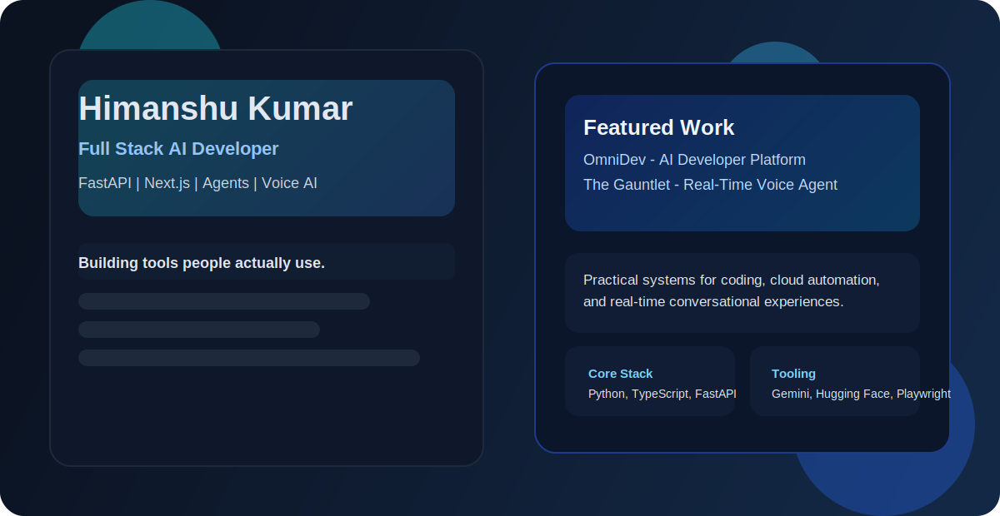
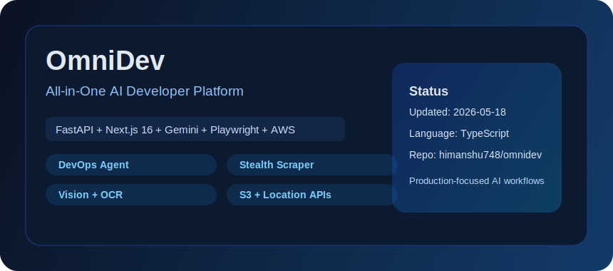
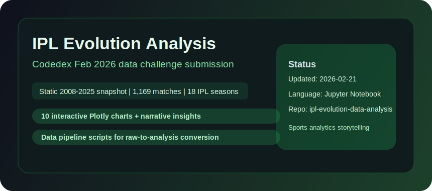
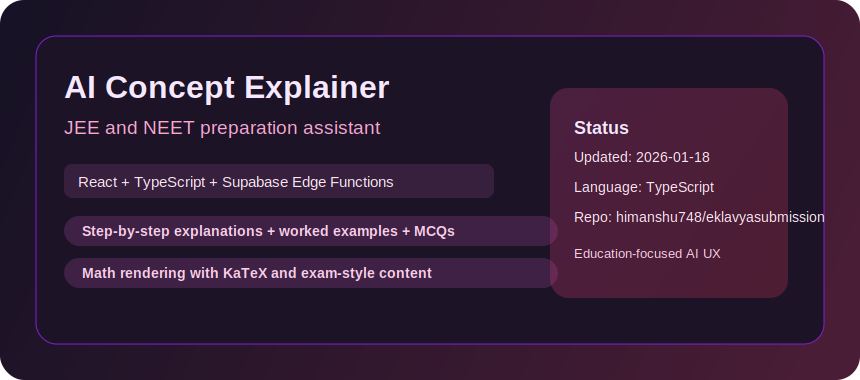
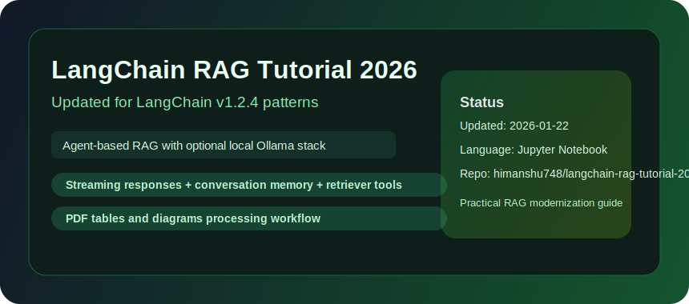
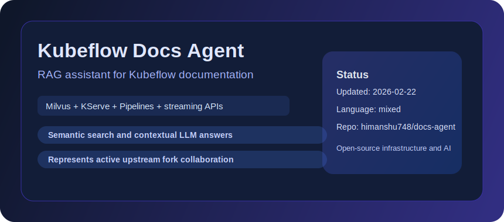
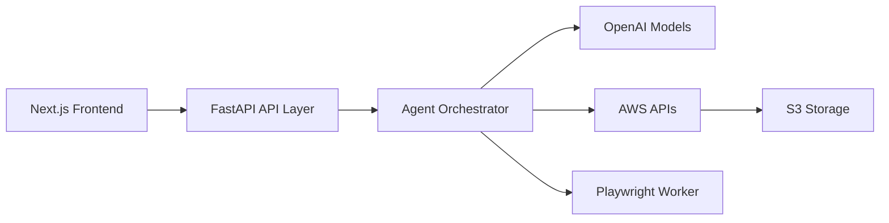
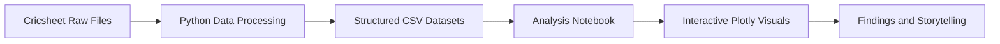
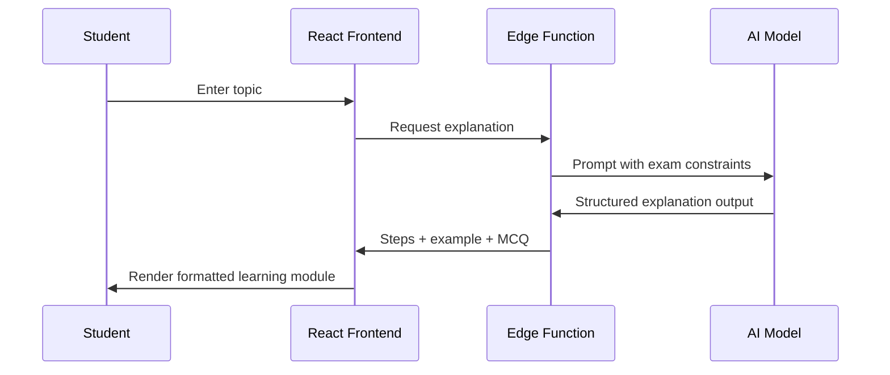

  

<h1 align="center">Himanshu Kumar</h1>

  <strong>Full Stack AI Developer</strong> 
  FastAPI | Next.js | AI Agents | Voice Systems | Data Products

  
  
  

  Building practical AI systems with reliable APIs, clean UX, and production-minded engineering.

---

## How I Build

| Area | Engineering focus |
| --- | --- |
| Agent systems | Tool-calling reliability, constrained outputs, failure-safe behavior |
| Product delivery | FastAPI backend + modern React/Next.js frontend |
| Voice and realtime | Low-latency STT -> model -> TTS loops |
| Data projects | Clear storytelling with reproducible analysis pipelines |
| OSS workflow | High-velocity iteration across active upstream forks |

---

## Best Projects (Live Snapshot: 2026-02-22)

Selection logic: recency of updates, technical depth, and direct end-user usefulness.

| Rank | Project | Type | Updated | Why it stands out |
| --- | --- | --- | --- | --- |
| 1 | [omnidev](https://github.com/himanshu748/omnidev) | Original | 2026-02-15 | Full-stack AI platform combining DevOps, scraping, vision, and storage workflows |
| 2 | [feb_challenge](https://github.com/himanshu748/feb_challenge) | Original | 2026-02-21 | End-to-end IPL analytics with large-scale dataset processing and interactive visualization |
| 3 | [eklavyasubmission](https://github.com/himanshu748/eklavyasubmission) | Original | 2026-01-18 | Education-focused AI explainer with structured exam-style output |
| 4 | [langchain-rag-tutorial-2026](https://github.com/himanshu748/langchain-rag-tutorial-2026) | Original | 2026-01-22 | Modern RAG patterns using agents, local model support, and streaming |
| 5 | [docs-agent](https://github.com/himanshu748/docs-agent) | OSS fork work | 2026-02-22 | Kubeflow documentation assistant architecture with RAG and K8s serving stack |

---

## Visual Project Gallery (Local Images)

All images below are stored in this repo under `assets/cards/` (no external image hosting).

  
  

  
  

  

---

## Interactive Deep Dive

<strong>OmniDev: platform architecture</strong>

 

**Core modules**
- DevOps agent for AWS command execution
- Stealth scraping workflows via Playwright
- Vision/OCR assistant workflows
- S3-driven storage operations
- Location intelligence API endpoints

<strong>IPL evolution analysis: data pipeline</strong>

 

**Dataset scale**
- 278,205 deliveries
- 1,169 matches
- 17 seasons (2008-2025)

**Output**
- 10 interactive Plotly visualizations
- Narrative findings around run-rate growth, bowling adaptation, and toss impact

<strong>AI Concept Explainer: product loop</strong>

 

**Product direction**
- Topic input for JEE/NEET syllabus areas
- Step-by-step explanations, worked examples, and MCQs
- Math rendering and exam-oriented learning flow

---

## Open Source Fork Activity (Current)

| Repository | Updated | Focus |
| --- | --- | --- |
| [docs-agent](https://github.com/himanshu748/docs-agent) | 2026-02-22 | Kubeflow documentation RAG assistant |
| [sdk](https://github.com/himanshu748/sdk) | 2026-02-22 | Python SDK for AI workloads on Kubernetes |
| [trainer](https://github.com/himanshu748/trainer) | 2026-02-22 | Distributed training and LLM fine-tuning workflows |
| [pipelines](https://github.com/himanshu748/pipelines) | 2026-02-22 | Kubeflow pipelines ecosystem work |
| [gemini-cli](https://github.com/himanshu748/gemini-cli) | 2026-02-22 | Terminal-native AI agent tooling |
| [jenkins](https://github.com/himanshu748/jenkins) | 2026-02-22 | CI/CD platform fork maintenance |

---

## Stack

  
  
  
  
  
  
  
  
  
  

---

## GitHub Stats

  
  

  

---

## Contact

- Email: [jhahimanshu653@gmail.com](mailto:jhahimanshu653@gmail.com)
- LinkedIn: [linkedin.com/in/himanshu748](https://linkedin.com/in/himanshu748)
- GitHub: [github.com/himanshu748](https://github.com/himanshu748)
