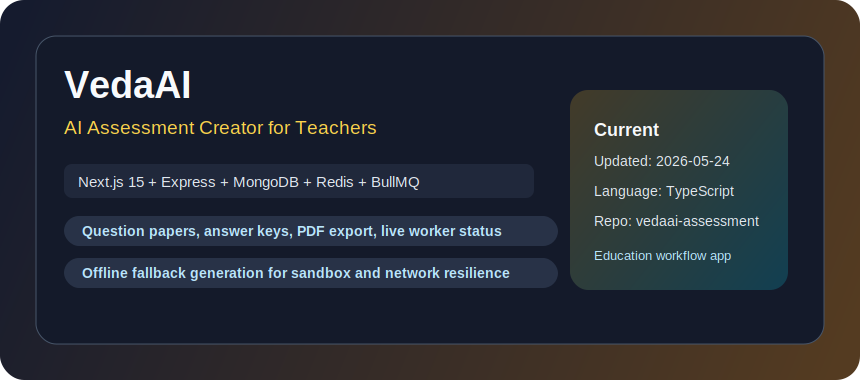
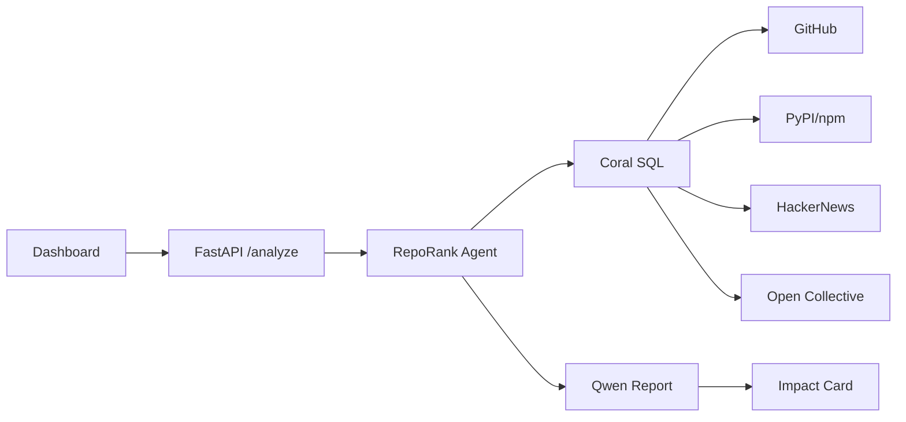
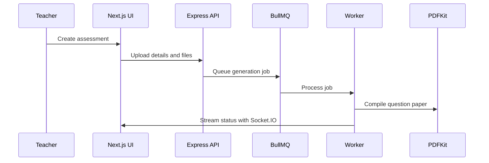
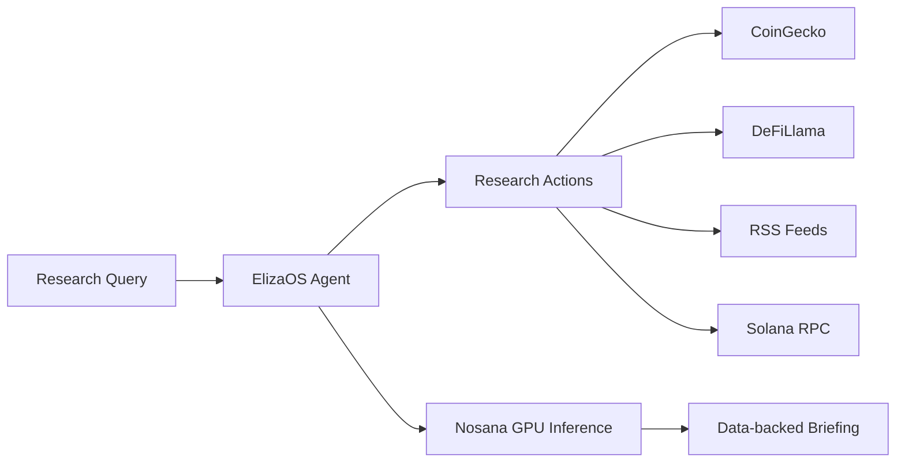

  

<h1 align="center">Himanshu Kumar</h1>

  <strong>Full Stack AI Developer</strong> 
  AI Agents | Full Stack Systems | Data Products | Developer Tools

  
  
  

  Building practical AI products with reliable APIs, polished interfaces, and production-minded engineering.

---

## How I Build

| Area | Engineering focus |
| --- | --- |
| Agent systems | Tool calling, structured output, reliable degradation |
| Product delivery | FastAPI/Express backends with React/Next.js frontends |
| Data products | Multi-source analysis, dashboards, reproducible pipelines |
| Realtime UX | Streaming updates, Socket.IO/SSE flows, live status feedback |
| Open source | Fast iteration across forks, hackathons, and upstream ecosystems |

---

## Best Projects (Snapshot: 2026-05-31)

Selection logic: recency of updates, technical depth, and direct end-user usefulness.

| Rank | Project | Type | Updated | Why it stands out |
| --- | --- | --- | --- | --- |
| 1 | [reporank](https://github.com/himanshu748/reporank) | Original | 2026-05-29 | Open source impact and funding-readiness agent using Coral SQL, FastAPI, and Qwen |
| 2 | [vedaai-assessment-creator](https://github.com/himanshu748/vedaai-assessment-creator) | Original | 2026-05-24 | Full-stack teacher workflow for AI-generated question papers, PDFs, and live job tracking |
| 3 | [omnidev](https://github.com/himanshu748/omnidev) | Original | 2026-05-18 | AI developer platform combining DevOps, scraping, vision, storage, and location tools |
| 4 | [sentinel-nosana-agent](https://github.com/himanshu748/sentinel-nosana-agent) | Original | 2026-04-13 | Crypto research agent on ElizaOS and Nosana with open market, DeFi, RSS, and Solana data |
| 5 | [prism-mistral-hackathon](https://github.com/himanshu748/prism-mistral-hackathon) | Original | 2026-02-28 | Multi-agent decision intelligence with Mistral tools, live debate, SSE streaming, and D3 graphs |
| 6 | [feb_challenge](https://github.com/himanshu748/feb_challenge) | Original | 2026-02-21 | IPL analytics across 278K+ deliveries, 1,169 matches, and 17 seasons |

---

## Visual Project Gallery (Local Images)

All images below are stored in this repo under `assets/cards/` (no external image hosting).

  
  

  
  

  
  

---

## Interactive Deep Dive

<strong>RepoRank: impact analysis flow</strong>

 

**Core modules**
- Cross-source Coral SQL joins over GitHub, PyPI/npm, HackerNews, and Open Collective
- FastAPI endpoint for repo analysis
- Qwen-powered narrative report generation
- Impact card with score, radar chart, pitch, and grant matches

<strong>VedaAI: assessment generation pipeline</strong>

 

**Core modules**
- Teacher assignment wizard with PDF/TXT uploads
- Express backend with MongoDB, Redis, BullMQ, and Socket.IO
- Background worker for LLM generation and PDF compilation
- Offline fallback generation for sandbox resilience

<strong>Sentinel: crypto research agent</strong>

 

**Core modules**
- ElizaOS agent runtime
- Market, token, news, research, and Nosana ecosystem actions
- CoinGecko, DeFiLlama, RSS, and Solana public RPC providers
- Nosana-hosted model inference with cached responses

---

## Current Repository Map

| Track | Repositories |
| --- | --- |
| Agent products | [reporank](https://github.com/himanshu748/reporank), [sentinel-nosana-agent](https://github.com/himanshu748/sentinel-nosana-agent), [prism-mistral-hackathon](https://github.com/himanshu748/prism-mistral-hackathon), [agent](https://github.com/himanshu748/agent) |
| Full-stack apps | [vedaai-assessment-creator](https://github.com/himanshu748/vedaai-assessment-creator), [omnidev](https://github.com/himanshu748/omnidev), [pr-review-agent](https://github.com/himanshu748/pr-review-agent), [Whack-a-bug](https://github.com/himanshu748/Whack-a-bug) |
| Data and notebooks | [feb_challenge](https://github.com/himanshu748/feb_challenge), [langchain-rag-tutorial-2026](https://github.com/himanshu748/langchain-rag-tutorial-2026), [deeplearning](https://github.com/himanshu748/deeplearning) |
| Open-source forks | [coral](https://github.com/himanshu748/coral), [OpenMetadata](https://github.com/himanshu748/OpenMetadata), [zed](https://github.com/himanshu748/zed), [gemini-cli](https://github.com/himanshu748/gemini-cli) |

---

## Stack

  
  
  
  
  
  
  
  
  
  

---

## GitHub Stats

  
  

  

---

## Contact

- Email: [jhahimanshu653@gmail.com](mailto:jhahimanshu653@gmail.com)
- LinkedIn: [linkedin.com/in/himanshu748](https://linkedin.com/in/himanshu748)
- GitHub: [github.com/himanshu748](https://github.com/himanshu748)
