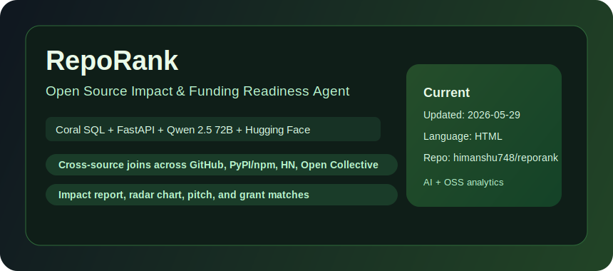
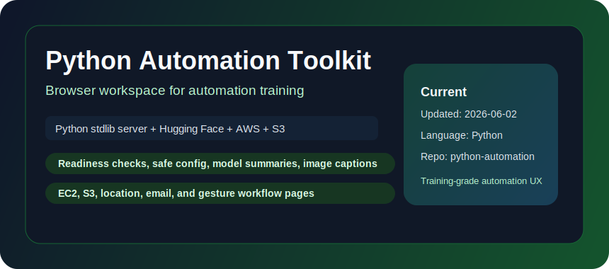
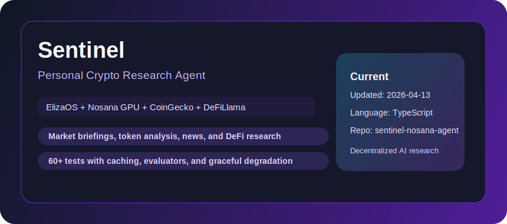
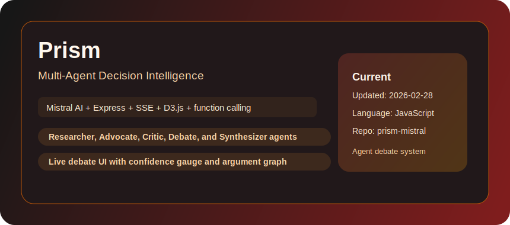
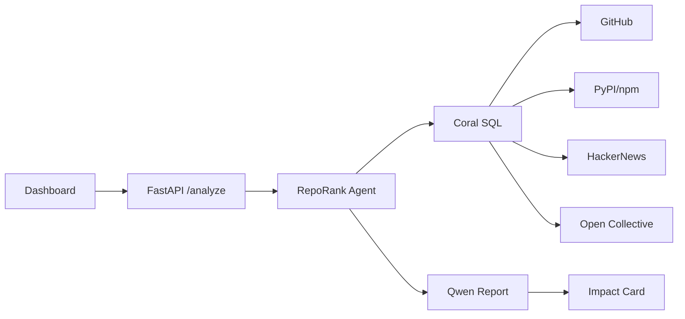
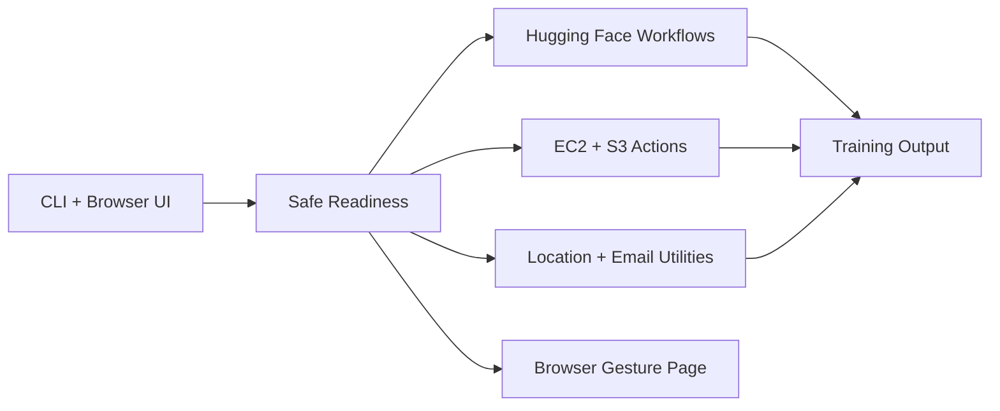
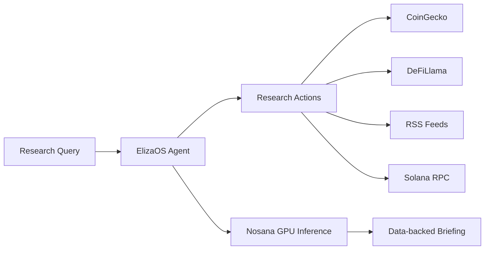

  

<h1 align="center">Himanshu Kumar</h1>

  <strong>Full Stack AI Developer</strong> 
  AI Agents | Full Stack Systems | Data Products | Developer Tools

  
  
  

  Building practical AI products with reliable APIs, polished interfaces, and production-minded engineering.

---

## How I Build

| Area | Engineering focus |
| --- | --- |
| Agent systems | Tool calling, structured output, reliable degradation |
| Product delivery | FastAPI/Express backends with React/Next.js frontends |
| Data products | Multi-source analysis, dashboards, reproducible pipelines |
| Realtime UX | Streaming updates, Socket.IO/SSE flows, live status feedback |
| Open source | Fast iteration across forks, hackathons, and upstream ecosystems |

---

## Best Projects (Snapshot: 2026-06-04)

Selection logic: recency of updates, technical depth, and direct end-user usefulness.

| Rank | Project | Type | Updated | Why it stands out |
| --- | --- | --- | --- | --- |
| 1 | [omnidev](https://github.com/himanshu748/omnidev) | Original | 2026-05-18 | Local-first AI developer platform with configurable APIs, Gemini code generation, browser-tested frontend, and FastAPI services |
| 2 | [sentinel-nosana-agent](https://github.com/himanshu748/sentinel-nosana-agent) | Original | 2026-04-13 | Crypto research agent on ElizaOS and Nosana with market, DeFi, RSS, Solana, and 60-test coverage |
| 3 | [python-automation-training-toolkit](https://github.com/himanshu748/python-automation-training-toolkit) | Original | 2026-06-02 | Browser workspace and CLI for safe automation training across Hugging Face, AWS, S3, location, email, and gestures |
| 4 | [prism-mistral-hackathon](https://github.com/himanshu748/prism-mistral-hackathon) | Original | 2026-02-28 | Multi-agent decision intelligence with Mistral tools, live debate, SSE streaming, and D3 graphs |
| 5 | [ipl-evolution-data-analysis](https://github.com/himanshu748/ipl-evolution-data-analysis) | Original | 2026-02-21 | IPL analytics across 278K+ deliveries, 1,169 matches, and 17 seasons |
| 6 | [langchain-rag-tutorial-2026](https://github.com/himanshu748/langchain-rag-tutorial-2026) | Original | 2026-01-22 | Practical RAG tutorial repo for modern LangChain-style retrieval workflows |

---

## Visual Project Gallery (Local Images)

All images below are stored in this repo under `assets/cards/` (no external image hosting).

  
  

  
  

  
  

---

## Interactive Deep Dive

<strong>RepoRank: impact analysis flow</strong>

 

**Core modules**
- Cross-source Coral SQL joins over GitHub, PyPI/npm, HackerNews, and Open Collective
- FastAPI endpoint for repo analysis
- Qwen-powered narrative report generation
- Impact card with score, radar chart, pitch, and grant matches

<strong>Python Automation Toolkit: training workflow</strong>

 

**Core modules**
- Browser workspace split across overview, model, cloud, utility, and gesture pages
- CLI commands for readiness checks, safe config display, model summaries, S3, EC2, location, and email
- Feature-specific configuration gates so readiness works without secrets
- Local HTTP server with bounded JSON bodies, static path checks, and image validation

<strong>Sentinel: crypto research agent</strong>

 

**Core modules**
- ElizaOS agent runtime
- Market, token, news, research, and Nosana ecosystem actions
- CoinGecko, DeFiLlama, RSS, and Solana public RPC providers
- Nosana-hosted model inference with cached responses

---

## Current Repository Map

| Track | Repositories |
| --- | --- |
| Agent products | [omnidev](https://github.com/himanshu748/omnidev), [sentinel-nosana-agent](https://github.com/himanshu748/sentinel-nosana-agent), [prism-mistral-hackathon](https://github.com/himanshu748/prism-mistral-hackathon), [prreviewiq-code-review-agent](https://github.com/himanshu748/prreviewiq-code-review-agent) |
| Developer and automation tools | [python-automation-training-toolkit](https://github.com/himanshu748/python-automation-training-toolkit), [apivault-api-docs-generator](https://github.com/himanshu748/apivault-api-docs-generator), [pr-review-agent](https://github.com/himanshu748/pr-review-agent), [langchain-rag-tutorial-2026](https://github.com/himanshu748/langchain-rag-tutorial-2026) |
| Data and notebooks | [ipl-evolution-data-analysis](https://github.com/himanshu748/ipl-evolution-data-analysis), [deeplearning](https://github.com/himanshu748/deeplearning), [financeiq-notion-finance-tracker](https://github.com/himanshu748/financeiq-notion-finance-tracker), [autopm-notion-product-manager](https://github.com/himanshu748/autopm-notion-product-manager) |
| Open-source contributions and forks | [OpenMetadata](https://github.com/himanshu748/OpenMetadata), [hive](https://github.com/himanshu748/hive), [coral](https://github.com/himanshu748/coral), [the-gauntlet-voice-agent](https://github.com/himanshu748/the-gauntlet-voice-agent) |

---

## Stack

  
  
  
  
  
  
  
  
  
  

---

## GitHub Stats

  
  

  

---

## Contact

- Email: [jhahimanshu653@gmail.com](mailto:jhahimanshu653@gmail.com)
- LinkedIn: [linkedin.com/in/himanshu748](https://linkedin.com/in/himanshu748)
- GitHub: [github.com/himanshu748](https://github.com/himanshu748)
