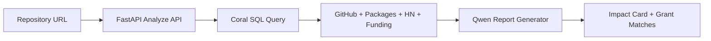
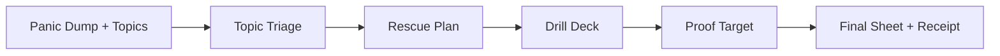
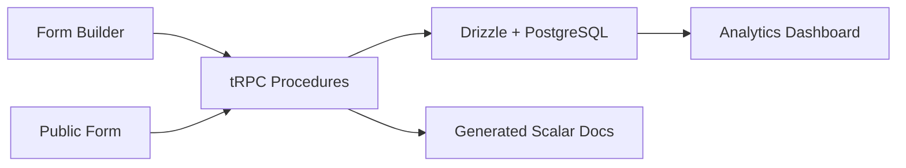

  

<h1 align="center">Himanshu Kumar</h1>

  <strong>Full Stack AI Developer</strong> 
  AI Agents | Full Stack Systems | Data Products | Developer Tools

  
  
  

  Building practical AI products with reliable APIs, polished interfaces, and production-minded engineering.

---

## How I Build

| Area | Engineering focus |
| --- | --- |
| Agent systems | Tool calling, structured output, reliable degradation |
| Product delivery | FastAPI/Express backends with React/Next.js frontends |
| Data products | Multi-source analysis, dashboards, reproducible pipelines |
| Realtime UX | Streaming updates, Socket.IO/SSE flows, live status feedback |
| Open source | Fast iteration across forks, hackathons, and upstream ecosystems |

---

## Best Projects (Snapshot: 2026-06-16)

Selection logic: technical depth, product completeness, current traffic, verification quality, and portfolio breadth.

| Rank | Project | Type | Updated | Why it stands out |
| --- | --- | --- | --- | --- |
| 1 | [reporank](https://github.com/himanshu748/reporank) | Original | 2026-06-09 | Open-source impact and funding-readiness agent that joins GitHub, PyPI/npm, Hacker News, and Open Collective signals through Coral SQL, then generates a grant-ready report with Qwen |
| 2 | [exam-panic-rescue](https://github.com/himanshu748/exam-panic-rescue) | Original | 2026-06-12 | Privacy-minded Gradio study assistant with strong clone traffic, multimodal small-model paths, real-user validation, and a complete student rescue workflow |
| 3 | [pixel-digit-recognizer](https://github.com/himanshu748/pixel-digit-recognizer) | Original | 2026-06-13 | Browser-only MNIST recognizer with the strongest recent profile traffic, four stars, Pyodide-powered NumPy inference, and no backend dependency |
| 4 | [FormOS](https://github.com/himanshu748/FormOS) | Original | 2026-06-13 | Full-stack retro OS form builder with Next.js, tRPC, Drizzle, PostgreSQL, public forms, QR sharing, analytics, and generated Scalar API docs |
| 5 | [omnidev](https://github.com/himanshu748/omnidev) | Original | 2026-06-04 | Local-first AI developer platform with configurable APIs, Gemini code generation, browser-tested frontend, and FastAPI services |
| 6 | [sentinel-nosana-agent](https://github.com/himanshu748/sentinel-nosana-agent) | Original | 2026-06-04 | Crypto research agent on ElizaOS and Nosana with market, DeFi, RSS, Solana, provider validation, and 70-test coverage |

---

## Visual Project Gallery (Local Images)

All images below are stored in this repo under `assets/cards/` (no external image hosting).

  
  

  
  

  
  

---

## Interactive Deep Dive

<strong>RepoRank: funding-readiness agent</strong>

 

**Core modules**
- FastAPI analysis endpoint with a Coral SQL orchestration layer
- Cross-source signals from GitHub, PyPI/npm, Hacker News, and Open Collective
- Hugging Face Qwen narrative generation for impact scoring and grant matching
- Shareable dashboard output with score, pitch, radar chart, and matching programs

<strong>Exam Panic Rescue: study triage workflow</strong>

 

**Core modules**
- Gradio product flow for one stressed student, one exam, and one time box
- Small-model routes with MiniCPM, Nemotron, and local llama.cpp support
- Vision-capable syllabus/photo handling plus text-only fallback paths
- Privacy-minded traces with anonymized real-user validation

<strong>FormOS: full-stack form platform</strong>

 

**Core modules**
- Turborepo workspace with Next.js, tRPC, Drizzle, and PostgreSQL
- Form editor, public form runner, QR sharing, and anonymous submissions
- Analytics dashboard with response table and per-field breakdowns
- Scalar docs generated from the live tRPC router

---

## Current Repository Map

| Track | Repositories |
| --- | --- |
| Best portfolio projects | [reporank](https://github.com/himanshu748/reporank), [exam-panic-rescue](https://github.com/himanshu748/exam-panic-rescue), [pixel-digit-recognizer](https://github.com/himanshu748/pixel-digit-recognizer), [FormOS](https://github.com/himanshu748/FormOS), [omnidev](https://github.com/himanshu748/omnidev), [sentinel-nosana-agent](https://github.com/himanshu748/sentinel-nosana-agent) |
| Agent products | [omnidev](https://github.com/himanshu748/omnidev), [sentinel-nosana-agent](https://github.com/himanshu748/sentinel-nosana-agent), [prism-mistral-hackathon](https://github.com/himanshu748/prism-mistral-hackathon), [prreviewiq-code-review-agent](https://github.com/himanshu748/prreviewiq-code-review-agent), [jee-neet-ai-concept-explainer](https://github.com/himanshu748/jee-neet-ai-concept-explainer) |
| Developer and automation tools | [python-automation-training-toolkit](https://github.com/himanshu748/python-automation-training-toolkit), [apivault-api-docs-generator](https://github.com/himanshu748/apivault-api-docs-generator), [pr-review-agent](https://github.com/himanshu748/pr-review-agent), [langchain-rag-tutorial-2026](https://github.com/himanshu748/langchain-rag-tutorial-2026), [webmcptutorial](https://github.com/himanshu748/webmcptutorial) |
| Full-stack products | [FormOS](https://github.com/himanshu748/FormOS), [launchproof-ai](https://github.com/himanshu748/launchproof-ai), [opportunity-scout](https://github.com/himanshu748/opportunity-scout), [hireiq-recruiting-assistant](https://github.com/himanshu748/hireiq-recruiting-assistant), [documate-ai](https://github.com/himanshu748/documate-ai) |
| Data and notebooks | [ipl-evolution-data-analysis](https://github.com/himanshu748/ipl-evolution-data-analysis), [deeplearning](https://github.com/himanshu748/deeplearning), [financeiq-notion-finance-tracker](https://github.com/himanshu748/financeiq-notion-finance-tracker), [autopm-notion-product-manager](https://github.com/himanshu748/autopm-notion-product-manager) |
| Open-source contributions and forks | [OpenMetadata](https://github.com/himanshu748/OpenMetadata), [hive](https://github.com/himanshu748/hive), [coral](https://github.com/himanshu748/coral), [the-gauntlet-voice-agent](https://github.com/himanshu748/the-gauntlet-voice-agent) |

---

## Stack

  
  
  
  
  
  
  
  
  
  

---

## GitHub Stats

  
  

  

---

## Contact

- Email: [jhahimanshu653@gmail.com](mailto:jhahimanshu653@gmail.com)
- LinkedIn: [linkedin.com/in/himanshu748](https://linkedin.com/in/himanshu748)
- GitHub: [github.com/himanshu748](https://github.com/himanshu748)
