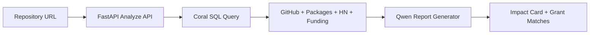
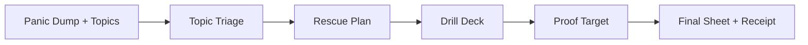
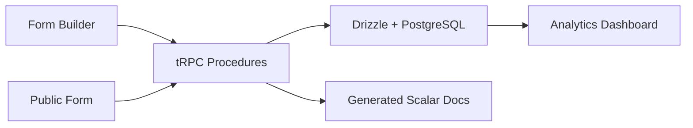

<!-- ═══════════════════════════════════════════════════════════════════════ -->
<!--                    ▓▓▓  CYBERPUNK PROFILE // himanshu748  ▓▓▓            -->
<!-- ═══════════════════════════════════════════════════════════════════════ -->

<!-- ── Animated neon header ────────────────────────────────────────────── -->
<p align="center">
  
</p>

<!-- ── Glitch typing subtitle ──────────────────────────────────────────── -->
<p align="center">
  <a href="https://github.com/himanshu748">
    
  </a>
</p>

<!-- ── Neon socials ────────────────────────────────────────────────────── -->
<p align="center">
  <a href="mailto:jhahimanshu653@gmail.com"></a>
  <a href="https://linkedin.com/in/himanshu748"></a>
  <a href="https://x.com/jhahimanshu653"></a>
  <a href="https://huggingface.co/HIMANSHUKUMARJHA"></a>
  <a href="https://github.com/himanshu748?tab=repositories"></a>
</p>

<!-- ── Neon divider ────────────────────────────────────────────────────── -->


<!-- ═══════════════════════════════════════════════════════════════════════ -->
<!--                          PROFILE VIEWER                                 -->
<!-- ═══════════════════════════════════════════════════════════════════════ -->

## `▚ PROFILE_VIEWER`

<div align="center">


<br/><br/>


</div>


## `▚ WHOAMI`

```ts
const himanshu: Engineer = {
  role:      "Full-Stack AI Developer",
  focus:     ["AI Agents", "Full-Stack Systems", "Data Products", "Developer Tools"],
  building:  "Practical AI products with reliable APIs & polished interfaces",
  backend:   "FastAPI · Express · tRPC · Drizzle · PostgreSQL",
  frontend:  "React · Next.js · TypeScript · Tailwind",
  edge:      "Agent tool-calling with structured outputs",
  mindset:   "Production-minded. Idea → MVP → Ship. Fast.",
};
```

### How I Build

| Area | Engineering focus |
| --- | --- |
| Agent systems | Tool calling, structured output, reliable degradation |
| Product delivery | FastAPI/Express backends with React/Next.js frontends |
| Data products | Multi-source analysis, dashboards, reproducible pipelines |
| Realtime UX | Streaming updates, Socket.IO/SSE flows, live status feedback |
| Open source | Fast iteration across forks, hackathons, and upstream ecosystems |


## `▚ TECH_ARSENAL`

<div align="center">


</div>


## `▚ BEST_PROJECTS`  <sub>// hand-picked</sub>

<table>
<tr>
<td width="50%" valign="top">

### 🛰️ [reporank](https://github.com/himanshu748/reporank)
Open-source impact & funding-readiness agent — joins GitHub, PyPI/npm, HN, and Open Collective via Coral SQL, then ships a grant-ready report with Qwen.
<br/><br/>
`FastAPI` `Coral SQL` `Qwen` `Agents`

</td>
<td width="50%" valign="top">

### 🧯 [exam-panic-rescue](https://github.com/himanshu748/exam-panic-rescue)
Privacy-minded Gradio study assistant — turns last-minute panic into triage plans, drills, and a final sheet. Multimodal small-model routes.
<br/><br/>
`Gradio` `LLM` `Vision` `Privacy`

</td>
</tr>
<tr>
<td width="50%" valign="top">

### 🔢 [pixel-digit-recognizer](https://github.com/himanshu748/pixel-digit-recognizer)
Browser-only MNIST recognizer — Pyodide runs a pure-NumPy neural net, zero backend, zero API calls.
<br/><br/>
`Pyodide` `NumPy` `ML` `No-API`

</td>
<td width="50%" valign="top">

### 🗂️ [FormOS](https://github.com/himanshu748/FormOS)
Retro-OS full-stack form builder — Next.js, tRPC, Drizzle, Postgres, public forms, QR sharing, analytics, generated Scalar docs.
<br/><br/>
`Next.js` `tRPC` `Drizzle` `Postgres`

</td>
</tr>
<tr>
<td width="50%" valign="top">

### 💻 [omnidev](https://github.com/himanshu748/omnidev)
Local-first AI developer platform — configurable APIs, Gemini code generation, browser-tested frontend, FastAPI services.
<br/><br/>
`AI` `Dev Tools` `FastAPI` `Gemini`

</td>
<td width="50%" valign="top">

### 🛡️ [sentinel-nosana-agent](https://github.com/himanshu748/sentinel-nosana-agent)
Crypto research agent on ElizaOS + Nosana — market, DeFi, RSS, Solana, provider validation, 70-test coverage.
<br/><br/>
`ElizaOS` `Nosana` `Solana` `DeFi`

</td>
</tr>
</table>


## `▚ ARCHITECTURE_DEEP_DIVE`

<details>
<summary><strong>▸ RepoRank: funding-readiness agent</strong></summary>

<br />

**Core modules**
- FastAPI analysis endpoint with a Coral SQL orchestration layer
- Cross-source signals from GitHub, PyPI/npm, Hacker News, and Open Collective
- Hugging Face Qwen narrative generation for impact scoring and grant matching
- Shareable dashboard output with score, pitch, radar chart, and matching programs


```mermaid
flowchart LR
  USER["Repository URL"] --> API["FastAPI Analyze API"]
  API --> CORAL["Coral SQL Query"]
  CORAL --> SOURCES["GitHub + Packages + HN + Funding"]
  SOURCES --> MODEL["Qwen Report Generator"]
  MODEL --> CARD["Impact Card + Grant Matches"]
```

</details>

<details>
<summary><strong>▸ Exam Panic Rescue: study triage workflow</strong></summary>

<br />

**Core modules**
- Gradio product flow for one stressed student, one exam, and one time box
- Small-model routes with MiniCPM, Nemotron, and local llama.cpp support
- Vision-capable syllabus/photo handling plus text-only fallback paths
- Privacy-minded traces with anonymized real-user validation


```mermaid
flowchart LR
  STUDENT["Panic Dump + Topics"] --> TRIAGE["Topic Triage"]
  TRIAGE --> PLAN["Rescue Plan"]
  PLAN --> DRILLS["Drill Deck"]
  DRILLS --> PROOF["Proof Target"]
  PROOF --> SHEET["Final Sheet + Receipt"]
```

</details>

<details>
<summary><strong>▸ FormOS: full-stack form platform</strong></summary>

<br />

**Core modules**
- Turborepo workspace with Next.js, tRPC, Drizzle, and PostgreSQL
- Form editor, public form runner, QR sharing, and anonymous submissions
- Analytics dashboard with response table and per-field breakdowns
- Scalar docs generated from the live tRPC router


```mermaid
flowchart LR
  BUILDER["Form Builder"] --> TRPC["tRPC Procedures"]
  PUBLIC["Public Form"] --> TRPC
  TRPC --> DB["Drizzle + PostgreSQL"]
  DB --> ANALYTICS["Analytics Dashboard"]
  TRPC --> DOCS["Generated Scalar Docs"]
```

</details>


## `▚ REPOSITORY_MAP`

| Track | Repositories |
| --- | --- |
| Best portfolio projects | [reporank](https://github.com/himanshu748/reporank), [exam-panic-rescue](https://github.com/himanshu748/exam-panic-rescue), [pixel-digit-recognizer](https://github.com/himanshu748/pixel-digit-recognizer), [FormOS](https://github.com/himanshu748/FormOS), [omnidev](https://github.com/himanshu748/omnidev), [sentinel-nosana-agent](https://github.com/himanshu748/sentinel-nosana-agent) |
| Agent products | [omnidev](https://github.com/himanshu748/omnidev), [sentinel-nosana-agent](https://github.com/himanshu748/sentinel-nosana-agent), [prism-mistral-hackathon](https://github.com/himanshu748/prism-mistral-hackathon), [prreviewiq-code-review-agent](https://github.com/himanshu748/prreviewiq-code-review-agent), [jee-neet-ai-concept-explainer](https://github.com/himanshu748/jee-neet-ai-concept-explainer) |
| Developer and automation tools | [python-automation-training-toolkit](https://github.com/himanshu748/python-automation-training-toolkit), [apivault-api-docs-generator](https://github.com/himanshu748/apivault-api-docs-generator), [pr-review-agent](https://github.com/himanshu748/pr-review-agent), [langchain-rag-tutorial-2026](https://github.com/himanshu748/langchain-rag-tutorial-2026), [webmcptutorial](https://github.com/himanshu748/webmcptutorial) |
| Full-stack products | [FormOS](https://github.com/himanshu748/FormOS), [launchproof-ai](https://github.com/himanshu748/launchproof-ai), [opportunity-scout](https://github.com/himanshu748/opportunity-scout), [hireiq-recruiting-assistant](https://github.com/himanshu748/hireiq-recruiting-assistant), [documate-ai](https://github.com/himanshu748/documate-ai) |
| Data and notebooks | [ipl-evolution-data-analysis](https://github.com/himanshu748/ipl-evolution-data-analysis), [deeplearning](https://github.com/himanshu748/deeplearning), [financeiq-notion-finance-tracker](https://github.com/himanshu748/financeiq-notion-finance-tracker), [autopm-notion-product-manager](https://github.com/himanshu748/autopm-notion-product-manager) |
| Open-source contributions and forks | [OpenMetadata](https://github.com/himanshu748/OpenMetadata), [hive](https://github.com/himanshu748/hive), [coral](https://github.com/himanshu748/coral), [the-gauntlet-voice-agent](https://github.com/himanshu748/the-gauntlet-voice-agent) |


## `▚ SYSTEM_ANALYTICS`

<div align="center">


</div>

<div align="center">


</div>

<div align="center">


</div>

<div align="center">


</div>


## `▚ CONTRIBUTION_SNAKE`

<div align="center">
  
</div>

<sub>Auto-regenerates daily via <code>.github/workflows/snake.yml</code>. Run it once from the <strong>Actions</strong> tab to seed the first frame.</sub>


## `▚ SPONSOR_ME`  💖

<div align="center">

**I build open AI products and developer tools — in the open, for free.**

If something I've shipped saved you time, sparked an idea, or you just want to back the next build,
sponsorship keeps the work shipping and the tools free for everyone.

<br />

<a href="https://github.com/sponsors/himanshu748">
  
</a>

</div>

### What your sponsorship fuels

| Tier | Amount | You get |
| :---: | :---: | :--- |
| ☕ **Espresso** | `$5 / mo` | My genuine thanks + your name in the supporters list below |
| ⚡ **Builder** | `$15 / mo` | Above + early access to new tools and priority issue responses |
| 🚀 **Backer** | `$50 / mo` | Above + a monthly 30-min talk — AI/agents, architecture, or your project |
| 🏆 **Patron** | `$100+ / mo` | Above + your logo/link featured here and across my project READMEs |

<div align="center">

*Prefer a one-off? GitHub Sponsors supports one-time gifts too — every bit is appreciated.*

<br />

**🌟 Current Sponsors**

<a href="https://github.com/sponsors/himanshu748"></a>

</div>


## `▚ CONTACT`

- **Email** — [jhahimanshu653@gmail.com](mailto:jhahimanshu653@gmail.com)
- **X** — [x.com/jhahimanshu653](https://x.com/jhahimanshu653)
- **LinkedIn** — [linkedin.com/in/himanshu748](https://linkedin.com/in/himanshu748)
- **GitHub** — [github.com/himanshu748](https://github.com/himanshu748)

<p align="center">
  
</p>
