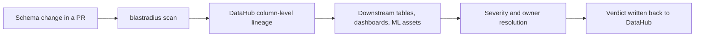
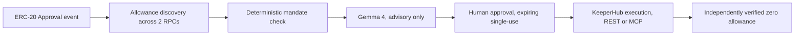
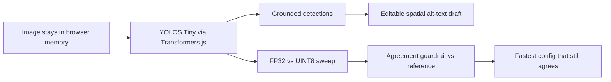

<!-- ═══════════════════════════════════════════════════════════════════════ -->
<!--                    ▓▓▓  CYBERPUNK PROFILE // himanshu748  ▓▓▓            -->
<!-- ═══════════════════════════════════════════════════════════════════════ -->

<!-- ── Animated neon header ────────────────────────────────────────────── -->
<p align="center">
  
</p>

<!-- ── Glitch typing subtitle ──────────────────────────────────────────── -->
<p align="center">
  <a href="https://github.com/himanshu748">
    
  </a>
</p>

<!-- ── Neon socials ────────────────────────────────────────────────────── -->
<p align="center">
  <a href="mailto:jhahimanshu653@gmail.com"></a>
  <a href="https://linkedin.com/in/himanshu748"></a>
  <a href="https://x.com/jhahimanshu653"></a>
  <a href="https://huggingface.co/HIMANSHUKUMARJHA"></a>
  <a href="https://github.com/himanshu748?tab=repositories"></a>
</p>

<!-- ── Neon divider ────────────────────────────────────────────────────── -->


<!-- ═══════════════════════════════════════════════════════════════════════ -->
<!--                          PROFILE VIEWER                                 -->
<!-- ═══════════════════════════════════════════════════════════════════════ -->

## `▚ PROFILE_VIEWER`

<div align="center">


<br/><br/>


</div>


## `▚ WHOAMI`

```ts
const himanshu: Engineer = {
  role:      "Full-Stack AI Developer",
  awards:    "🏆 Won the Hugging Face Tiny Titan track with Thousand Tokens Theatre",
  focus:     ["AI Agents", "Full-Stack Systems", "Data Products", "Developer Tools"],
  building:  "Practical AI products with reliable APIs & polished interfaces",
  backend:   "FastAPI · Express · tRPC · Drizzle · PostgreSQL",
  frontend:  "React · Next.js · TypeScript · Tailwind",
  edge:      "Agent tool-calling with structured outputs",
  mindset:   "Production-minded. Idea → MVP → Ship. Fast.",
};
```

### How I Build

| Area | Engineering focus |
| --- | --- |
| Agent systems | Tool calling, structured output, reliable degradation |
| Product delivery | FastAPI/Express backends with React/Next.js frontends |
| Data products | Multi-source analysis, dashboards, reproducible pipelines |
| Realtime UX | Streaming updates, Socket.IO/SSE flows, live status feedback |
| Open source | Fast iteration across forks, hackathons, and upstream ecosystems |


## `▚ TECH_ARSENAL`

<div align="center">


</div>


## `▚ BEST_PROJECTS`  <sub>// hand-picked</sub>

<table>
<tr>
<td width="50%" valign="top">

### 💥 [blastradius](https://github.com/himanshu748/blastradius)
Pre-merge impact analysis for schema changes. Walks DataHub column-level lineage to find every downstream table, dashboard and ML asset a dropped column breaks, names each owner, then writes the verdict back into DataHub.
<br/><br/>
`DataHub` `Lineage` `Python` `CLI`

</td>
<td width="50%" valign="top">

### 🔐 [circuit-allowance-sentinel](https://github.com/himanshu748/circuit-allowance-sentinel)
Policy-gated incident response for onchain treasuries. Revokes a risky ERC-20 approval only after a deterministic mandate check, transaction preflight and human approval. Local Gemma 4 reasoning stays advisory.
<br/><br/>
`KeeperHub` `Gemma 4` `ERC-20` `MCP`

</td>
</tr>
<tr>
<td width="50%" valign="top">

### 🖼️ [framekind](https://github.com/himanshu748/framekind)
Private alt-text drafts that never leave the browser. YOLOS Tiny runs on-device with grounded detection overlays, shipped with a rerunnable Arm64 sweep showing the backend, not quantization, was the real lever.
<br/><br/>
`WebGPU` `Transformers.js` `Arm64` `A11y`

</td>
<td width="50%" valign="top">

### 📡 [otel-swarm](https://github.com/himanshu748/otel-swarm)
OpenTelemetry instrumentation for multi-agent LLM systems, with importable SigNoz dashboards and alerts so agent runs are traceable like any other service.
<br/><br/>
`OpenTelemetry` `SigNoz` `Agents` `Tracing`

</td>
</tr>
<tr>
<td width="50%" valign="top">

### 💻 [omnidev](https://github.com/himanshu748/omnidev)
Native macOS AI dev cockpit. A local Gemma 4 model reads your files and screenshots, answers with citations, edits code and runs your tests. Fully offline, no API keys.
<br/><br/>
`macOS` `Gemma 4` `RAG` `Offline`

</td>
<td width="50%" valign="top">

### 🛡️ [railguard](https://github.com/himanshu748/railguard)
A policy and human-approval layer between an AI agent and the Razorpay API. Every write is executed, parked for review or denied by a named rule, with a hash-chained audit log.
<br/><br/>
`Razorpay` `Policy` `Audit Log` `Python`

</td>
</tr>
<tr>
<td width="50%" valign="top">

### 🐝 [devswarm](https://github.com/himanshu748/devswarm)
Multi-agent app generator running on open models, wired so it watches itself. Every agent is traced into SigNoz, which makes a swarm run as debuggable as any ordinary service.
<br/><br/>
`Multi-Agent` `SigNoz` `Open Models` `Tracing`

</td>
<td width="50%" valign="top">

### 🧠 [ContextFirewall](https://github.com/himanshu748/ContextFirewall)
A trust firewall for AI coding-agent memory, built on Cognee. Audits every remembered fact for staleness, contradiction, secrets and evidence before it reaches your agent. MCP-native.
<br/><br/>
`Cognee` `MCP` `Memory` `Guardrails`

</td>
</tr>
</table>


## `▚ ARCHITECTURE_DEEP_DIVE`

<details>
<summary><strong>▸ blastradius: schema-change impact analysis</strong></summary>

<br />

**Core modules**
- DataHub client walking column-level lineage hop by hop from the changed column
- Severity classifier separating breaking, risky and unaffected downstream assets
- Owner resolution for every impacted table, dashboard, job and ML asset
- Assessment written back into DataHub so the finding lives with the data


```mermaid
flowchart LR
  PR["Schema change in a PR"] --> SCAN["blastradius scan"]
  SCAN --> LIN["DataHub column-level lineage"]
  LIN --> DOWN["Downstream tables, dashboards, ML assets"]
  DOWN --> SEV["Severity and owner resolution"]
  SEV --> BACK["Verdict written back to DataHub"]
```

</details>

<details>
<summary><strong>▸ Circuit: policy-gated allowance revocation</strong></summary>

<br />

**Core modules**
- Live allowance discovery from onchain Approval history, cross-checked across two RPCs
- Deterministic mandate check with canonical payload hashing
- Local Gemma 4 reasoning over loopback-only Ollama, advisory and unable to widen policy
- KeeperHub REST and MCP execution adapters behind one safety contract


```mermaid
flowchart LR
  APPR["ERC-20 Approval event"] --> DISC["Allowance discovery across 2 RPCs"]
  DISC --> POLICY["Deterministic mandate check"]
  POLICY --> LLM["Gemma 4, advisory only"]
  LLM --> HUMAN["Human approval, expiring single-use"]
  HUMAN --> KH["KeeperHub execution, REST or MCP"]
  KH --> PROOF["Independently verified zero allowance"]
```

</details>

<details>
<summary><strong>▸ FrameKind: on-device alt text with a quality guardrail</strong></summary>

<br />

**Core modules**
- YOLOS Tiny running in-browser through Transformers.js, image never leaves memory
- Grounded detection overlay turned into an editable spatial alt-text draft
- Rerunnable device sweep comparing FP32 and UINT8 across WASM and WebGPU
- Agreement guardrail scoring every configuration against the full-precision reference


```mermaid
flowchart LR
  IMG["Image stays in browser memory"] --> MODEL["YOLOS Tiny via Transformers.js"]
  MODEL --> DET["Grounded detections"]
  DET --> ALT["Editable spatial alt-text draft"]
  MODEL --> SWEEP["FP32 vs UINT8 sweep"]
  SWEEP --> GUARD["Agreement guardrail vs reference"]
  GUARD --> PICK["Fastest config that still agrees"]
```

</details>


## `▚ REPOSITORY_MAP`

| Track | Repositories |
| --- | --- |
| Best portfolio projects | [blastradius](https://github.com/himanshu748/blastradius), [circuit-allowance-sentinel](https://github.com/himanshu748/circuit-allowance-sentinel), [framekind](https://github.com/himanshu748/framekind), [otel-swarm](https://github.com/himanshu748/otel-swarm), [omnidev](https://github.com/himanshu748/omnidev), [railguard](https://github.com/himanshu748/railguard), [devswarm](https://github.com/himanshu748/devswarm), [ContextFirewall](https://github.com/himanshu748/ContextFirewall) |
| Agent products | [dhurandhar](https://github.com/himanshu748/dhurandhar), [swarmshift](https://github.com/himanshu748/swarmshift), [agentbench](https://github.com/himanshu748/agentbench), [sentinel-nosana-agent](https://github.com/himanshu748/sentinel-nosana-agent), [prism-mistral-hackathon](https://github.com/himanshu748/prism-mistral-hackathon) |
| Developer and automation tools | [omnidev](https://github.com/himanshu748/omnidev), [vulcan](https://github.com/himanshu748/vulcan), [pr-review-agent](https://github.com/himanshu748/pr-review-agent), [apivault-api-docs-generator](https://github.com/himanshu748/apivault-api-docs-generator), [python-automation-training-toolkit](https://github.com/himanshu748/python-automation-training-toolkit), [webmcptutorial](https://github.com/himanshu748/webmcptutorial) |
| Observability | [otel-swarm](https://github.com/himanshu748/otel-swarm), [devswarm](https://github.com/himanshu748/devswarm), [signoz-agent-observability](https://github.com/himanshu748/signoz-agent-observability) |
| Onchain and ZK | [circuit-allowance-sentinel](https://github.com/himanshu748/circuit-allowance-sentinel), [veilpledge](https://github.com/himanshu748/veilpledge), [commitpass-stellar-rsvp](https://github.com/himanshu748/commitpass-stellar-rsvp), [matchday-pulse](https://github.com/himanshu748/matchday-pulse) |
| Full-stack products | [FormOS](https://github.com/himanshu748/FormOS), [reporank](https://github.com/himanshu748/reporank), [launchproof-ai](https://github.com/himanshu748/launchproof-ai), [opportunity-scout](https://github.com/himanshu748/opportunity-scout), [hireiq-recruiting-assistant](https://github.com/himanshu748/hireiq-recruiting-assistant), [documate-ai](https://github.com/himanshu748/documate-ai) |
| Data and notebooks | [ipl-evolution-data-analysis](https://github.com/himanshu748/ipl-evolution-data-analysis), [deeplearning](https://github.com/himanshu748/deeplearning), [langchain-rag-tutorial-2026](https://github.com/himanshu748/langchain-rag-tutorial-2026), [financeiq-notion-finance-tracker](https://github.com/himanshu748/financeiq-notion-finance-tracker), [autopm-notion-product-manager](https://github.com/himanshu748/autopm-notion-product-manager) |
| Open-source contributions and forks | [langchain](https://github.com/himanshu748/langchain), [smolagents](https://github.com/himanshu748/smolagents), [cognee](https://github.com/himanshu748/cognee), [OpenMetadata](https://github.com/himanshu748/OpenMetadata), [coral](https://github.com/himanshu748/coral), [hive](https://github.com/himanshu748/hive) |


## `▚ SYSTEM_ANALYTICS`

<div align="center">


</div>

<div align="center">


</div>

<div align="center">


</div>

<div align="center">


</div>


## `▚ CONTRIBUTION_SNAKE`

<div align="center">
  
</div>

<sub>Auto-regenerates daily via <code>.github/workflows/snake.yml</code>. Run it once from the <strong>Actions</strong> tab to seed the first frame.</sub>


## `▚ SPONSOR_ME`  💖

<div align="center">

**I build open AI products and developer tools — in the open, for free.**

If something I've shipped saved you time, sparked an idea, or you just want to back the next build,
sponsorship keeps the work shipping and the tools free for everyone.

<br />

<a href="https://github.com/sponsors/himanshu748">
  
</a>

</div>

### What your sponsorship fuels

| Tier | Amount | You get |
| :---: | :---: | :--- |
| ☕ **Espresso** | `$5 / mo` | My genuine thanks + your name in the supporters list below |
| ⚡ **Builder** | `$15 / mo` | Above + early access to new tools and priority issue responses |
| 🚀 **Backer** | `$50 / mo` | Above + a monthly 30-min talk — AI/agents, architecture, or your project |
| 🏆 **Patron** | `$100+ / mo` | Above + your logo/link featured here and across my project READMEs |

<div align="center">

*Prefer a one-off? GitHub Sponsors supports one-time gifts too — every bit is appreciated.*

<br />

**🌟 Current Sponsors**

<a href="https://github.com/sponsors/himanshu748"></a>

</div>


## `▚ CONTACT`

- **Email** — [jhahimanshu653@gmail.com](mailto:jhahimanshu653@gmail.com)
- **X** — [x.com/jhahimanshu653](https://x.com/jhahimanshu653)
- **LinkedIn** — [linkedin.com/in/himanshu748](https://linkedin.com/in/himanshu748)
- **GitHub** — [github.com/himanshu748](https://github.com/himanshu748)

<p align="center">
  
</p>
